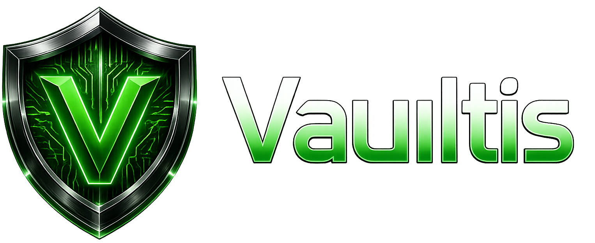

<div align="center">


<br /><br />

<p><strong>A privacy-first, zero-knowledge, fully encrypted local vault for passwords, notes, and files.</strong><br />Built for people who refuse to trust the cloud with what matters most.</p>

[](https://github.com/sambhavdwivediofficial/Vaultis/blob/main/LICENSE) [](https://github.com/sambhavdwivediofficial/Vaultis) [](https://github.com/sambhavdwivediofficial/Vaultis) [](https://tauri.app) [](https://react.dev) [](https://rust-lang.org) [](https://sqlite.org) [](https://github.com/sambhavdwivediofficial/Vaultis) [](https://github.com/sambhavdwivediofficial/Vaultis) [](https://github.com/sambhavdwivediofficial/Vaultis) [](https://github.com/sambhavdwivediofficial/Vaultis) [](https://github.com/sambhavdwivediofficial/Vaultis) [](https://rust-lang.org) [](https://github.com/sambhavdwivediofficial/Vaultis)
<br />
[](https://www.sambhavdwivedi.in)

[Website](https://vaultis.sambhavdwivedi.in) &nbsp;&bull;&nbsp;
[LinkedIn](https://www.linkedin.com/in/sambhavdwivedi) &nbsp;&bull;&nbsp;
[Report a Bug](https://github.com/sambhavdwivediofficial/Vaultis/issues)
</div>

---
<div align="center">

## What is Vaultis

</div>

Vaultis is a **desktop-native encrypted vault** designed from the ground up for people who take privacy seriously. Everything — your passwords, notes, and files — is encrypted locally on your device using military-grade AES-256-GCM encryption before it ever touches disk. There is no cloud, no account, no telemetry, and no third party that can see your data.

The philosophy behind Vaultis is simple: your data belongs to you. Not to a company. Not to a server. Not to anyone who might be watching the network. Vaultis operates entirely offline, meaning it works with zero internet connection and stores everything in a single encrypted database file on your machine.

This is not a web app wrapped in a browser shell. Vaultis is built on **Tauri 2.0** with a **Rust** backend, giving it the performance and security guarantees of a native application at a fraction of the binary size of Electron-based alternatives. The frontend is crafted in **React 18** with a fully custom design system — no component library, no borrowed UI, no shortcuts.

---

<div align="center">

## Core Philosophy

</div>

**Zero Knowledge** — The master password never leaves your device. Vaultis uses Argon2id key derivation to transform your password into an encryption key. The key is held in memory only while the vault is unlocked and is wiped the moment you lock it.

**Local First** — Every byte of your data lives on your machine. No sync, no backup to external servers, no analytics pinging home. Vaultis treats your filesystem as the source of truth and nothing else.

**No Trust Required** — You should not have to trust Vaultis the software or any infrastructure it runs on. The encryption happens before persistence, which means even if someone gained access to the vault database file, they would find nothing without your master password.

**Native Performance** — The Rust backend handles all cryptographic operations, database reads and writes, and file system access. The React frontend communicates with it through Tauri's typed command layer. The result is an application that starts in milliseconds and responds instantly.

---

<div align="center">

## What Vaultis Protects

</div>

**Passwords** — Save account credentials with associated usernames, URLs, and notes. Each password entry is encrypted individually. Vaultis includes a built-in password generator capable of producing cryptographically random passwords up to 64 characters with full control over character sets, symbol inclusion, and ambiguous character exclusion.

**Notes** — Write private notes with full Markdown support. Notes can be tagged, color-coded, pinned, and organized entirely within the encrypted vault. Nothing is stored in plain text — every character of every note is encrypted at rest.

**Files** — Upload any file up to 2GB and have it encrypted and stored inside the vault. Documents, images, PDFs, private keys, legal records — anything you need to protect can be stored here. Files can be exported back to disk on demand, decrypted only at the moment of export.

---

<div align="center">

## Security Architecture

</div>

The security model of Vaultis is built around several non-negotiable principles that are enforced at the architecture level, not as optional settings.

**Encryption at Rest** — The vault database is encrypted using AES-256-GCM. Every row, every field, every file blob is encrypted before being written to SQLite. The database file itself contains no readable data without the master key.

**Key Derivation** — Argon2id is used to derive the master encryption key from the user's password. The parameters are tuned to be computationally expensive for attackers running brute-force attacks while remaining fast enough for normal unlock operations on consumer hardware.

**Memory Safety** — The backend is written in Rust. There are no null pointer dereferences, no buffer overflows, no use-after-free vulnerabilities. The type system and borrow checker enforce memory correctness at compile time, making an entire class of security vulnerabilities structurally impossible.

**Auto-lock** — The vault automatically locks after a configurable period of inactivity. When locked, the decryption key is wiped from memory. The application can also be emergency-locked instantly with a keyboard shortcut from anywhere in the interface.

**Clipboard Security** — When you copy a password, Vaultis automatically clears the clipboard after a configurable delay (default 30 seconds). This prevents clipboard snooping tools from capturing sensitive data that was left behind after use.

**Soft Delete** — Deleted items are not immediately destroyed. They are moved to a protected trash state, giving you a recovery window before permanent deletion. Permanent deletion is irreversible and requires explicit confirmation.

**Encrypted Backups** — When you create a backup, the entire vault is re-encrypted and written to a single portable file. The backup can only be restored with the correct master password. Backups are designed to be stored on external media or separate machines entirely independent of the primary device.

---

<div align="center">

## How It Works

</div>

```
                                         Your Password
                                              │
                                              ▼
                            ┌─────────────────────────────────┐
                            │       Argon2id  Key Derivation  │   High memory cost · Time cost
                            │       Salt: unique per vault    │   Resistant to GPU brute force
                            └──────────────────┬──────────────┘
                                               │
                                               ▼
                                        Master Key (256-bit)
                                               │
                                 ┌─────────────┼──────────────┐
                                 ▼             ▼              ▼
                            ┌─────────┐   ┌──────────┐  ┌──────────┐
                            │  Notes  │   │Passwords │  │  Files   │
                            │AES-256- │   │AES-256-  │  │AES-256-  │
                            │  GCM    │   │  GCM     │  │  GCM     │
                            └────┬────┘   └────┬─────┘  └────┬─────┘
                                 └─────────────┴─────────────┘
                                               │
                                               ▼
                                   SQLite (Encrypted at rest)
                                   Single local .db file
                                   Zero readable data without key
```

```
                                                Unlock Flow
                          ──────────────────────────────────────────────────────────
          
                              App Start ──► Vault Exists? ──No──► Welcome / Setup
                                                │
                                               Yes
                                                │
                                                ▼
                                          Enter Password
                                                │
                                                ▼
                                       Argon2id Derivation
                                                │
                                                ▼
                                      AES-256-GCM Verify ──Fail──►  Attempt Counter
                                                │                   (Max 5, then lock)
                                               Pass
                                                │
                                                ▼
                                       Key held in memory
                                         Vault unlocked
                                                │
                                                ▼
                                       Auto-lock timer starts
                                     Ctrl+Shift+L = instant lock
```

---

<div align="center">

## Design & Interface

</div>

Vaultis was designed as a deliberate rejection of the tendency in security software to be functional but visually neglected. The interface is built on a fully custom glass morphism design system with a dark-first aesthetic, an emerald accent palette, and a typographic hierarchy using Syne for display text, DM Sans for body copy, and DM Mono for passwords and code.

Every interaction has been considered. Cards reveal actions on hover. Passwords can be revealed or masked with a single click. The sidebar collapses to icon-only mode to maximize workspace. The search bar expands inline. Modals animate in from below. Skeletons replace spinners during data loading. The application responds instantly because the underlying architecture makes slowness structurally impossible.

The design system is token-driven, with every color, spacing value, shadow, border radius, and animation curve defined as a CSS custom property. Dark and light themes are fully supported with automatic system preference detection. The interface is responsive across all screen sizes, from compact laptop screens to large external monitors.

---

<div align="center">

## Technology

</div>

Vaultis is built on a carefully chosen stack where each technology was selected for a specific reason and not for trend or familiarity.

**Tauri 2.0** provides the native shell. Unlike Electron, Tauri uses the operating system's built-in web renderer and a Rust core, producing binaries that are smaller by an order of magnitude and significantly more secure by surface area.

**Rust** is the backend language. The cryptographic operations, database layer, file I/O, and all sensitive data handling are implemented in Rust. The `rusqlite` and `r2d2` crates handle the SQLite connection pool. The `aes-gcm` and `argon2` crates handle encryption and key derivation respectively.

**React 18** is the frontend framework. The UI is driven entirely by Zustand stores with no prop drilling and no redundant re-renders. React Router 6 handles navigation between vault sections. All components are written in plain JavaScript with no TypeScript overhead.

**CSS Modules** scope all styles to their components. There is no global class pollution, no specificity conflicts, and no runtime style injection. The design system lives in CSS custom properties that cascade cleanly through the component tree.

**SQLite** is the storage engine. A single `.db` file holds the entire vault. This makes backups trivial, portability straightforward, and the data model completely self-contained.

---

<div align="center">

## Features at a Glance

</div>

**Vault Management**
— Master password creation with Argon2id key derivation
— Recovery key generation on vault creation
— Auto-lock with configurable timeout from 1 minute to 4 hours
— Emergency lock via keyboard shortcut at any time
— Master password change without data loss
— Vault metadata and stats visible from the dashboard

**Notes**
— Full Markdown support with rendered preview
— Tags, custom colors, and pin-to-top functionality
— Full-text search across all note content
— Soft delete with restore from trash

**Passwords**
— Credential storage with username, URL, password, and notes
— Built-in cryptographically random password generator
— Password strength visualization on a five-point scale
— Favorite marking and filter view
— Copy-to-clipboard with configurable auto-clear timer
— Full-text search across all entries

**Files**
— Drag-and-drop upload with encryption before storage
— Support for any file type up to 2GB
— Inline preview for images and PDF documents
— Export (decrypt to disk) on demand
— Full-text search by filename and metadata

**Backup and Restore**
— One-click encrypted backup creation
— Restore from any backup file with password verification
— Backup integrity verification before restore
— Delete old backups from the backup history

**Organization**
— Tag-based organization across notes, passwords, and files
— Tag cloud view with item counts per tag
— Trash with filter by content type
— Restore individual items or empty trash permanently

**Settings**
— Auto-lock timer configuration
— Clipboard auto-clear timer
— Font size adjustment
— Compact mode for high-density displays
— Launch at startup and minimize to tray options
— Password strength indicator toggle

---

<div align="center">

## Supported Platforms

</div>

Vaultis is a cross-platform desktop application that runs natively on all major operating systems.

**Windows** — Windows 10 and later, x64. Distributed as an NSIS installer.

**macOS** *(Coming Soon)* — macOS 11 Big Sur and later, x64 and Apple Silicon. Distributed as a DMG.

**Linux** *(Coming Soon)* — Ubuntu 20.04+, Debian 10+, Fedora 35+, Arch Linux. Distributed as AppImage and .deb.

---

<div align="center">

## Privacy Guarantee

</div>

Vaultis does not collect usage analytics. It does not send crash reports to external servers. It does not make any outbound network requests of any kind during normal operation. The only network activity that can occur is when you explicitly request something that requires it, such as loading a favicon for a saved password entry.

There are no accounts. There is no registration. There is nothing to delete from any server because there is nothing stored anywhere except on your own machine.

The vault database, the backup files, and the application logs all remain entirely local. If you uninstall Vaultis, your data does not leave with it. You control where it lives, and you control what happens to it.

---

<div align="center">

## License

Copyright &copy; 2026 Sambhav Dwivedi. All Rights Reserved.

This software, its source code, design system, and all associated assets are proprietary.<br />
No part of this codebase may be reproduced, distributed, modified, or used in any form<br />
without explicit written permission from the author.

[](https://www.linkedin.com/in/sambhavdwivedi/)
[](https://www.sambhavdwivedi.in)
[](https://github.com/sambhavdwivediofficial)
  
*Built & Maintained by ***Sambhav Dwivedi***.*
</div>